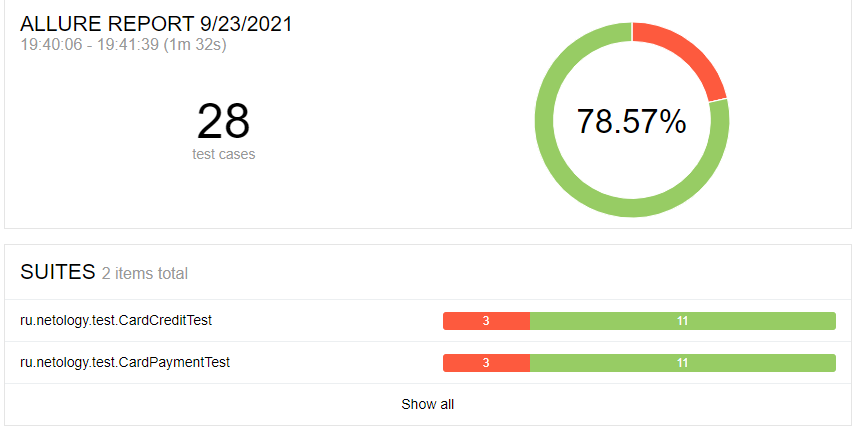

# Отчёт о проведении автоматизированного тестирования покупки тура в Маракеш.
# Краткое описание:
Проведено автоматизированное тестирования сервиса покупки тура в Маракеш. В ходе тестирования были реализованы и пройдены как позитивные, так и негативные сценарии работы с сервисом. По результатам тестов были выявлены ошибки в работе сервиса.
# Количество тест-кейсов:
При проведении тестирования использовались 28 тест кейсов. 4 позитивных и 24 негативных. Из данного количества тест кейсов успешно пройдены 22(78%).

# Общие рекомендации:
Необходимо исправить все найдённые баги и повторить тестирование.